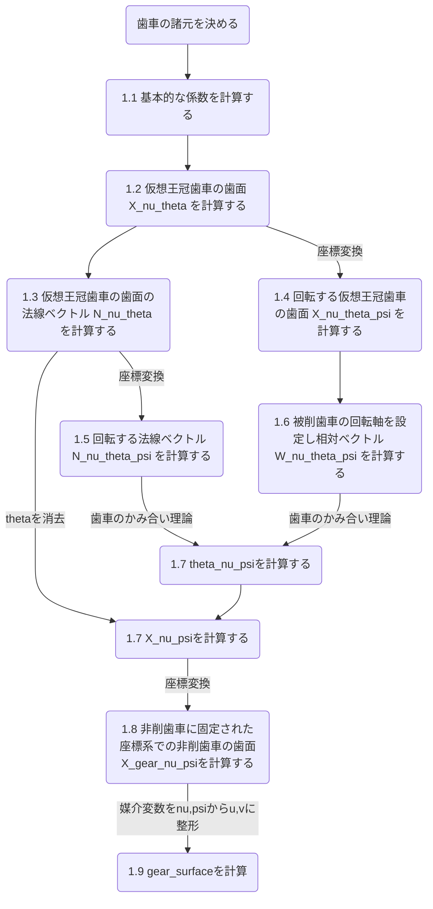

# Klingelnberg (Cyclo-Palloid) spiral bevel gear

## はじめに
クリンゲルンベルグ社のサイクロパロイド方式のスパイラルベベルギアはオクトイドの一種<sup>[1](#ref1)</sup>で歯の高さが歯すじ方向で一定で(等高歯)で歯すじがトロコイド曲線になっているスパイラルベベルギアである. 
歯切りはこれ<sup>[2](#ref2)</sup>をみるとよくわかる. 

通常のインボリュート平歯車と異なり汎用の3DCADで簡単に自動生成できないため勉強もかねてモデリング方法をまとめる.  本記事の対象者は数年後にすべてを忘れた自分であるため万人向けではない. 
 
仮想王冠歯車を使った歯面計算方法についてイワサテック辻さんの論文<sup>[3](#ref3)</sup>に非常に詳細に記載されている. 本記事ではこの論文の補足と実装方法の説明が主になる. 一応辻さんの論文がリンク切れ等で読めなくなった時の対策として必要な数式はこちらにも記載しておく. $E_{xb}$の定義など一部簡略化のためであったりモデリングのために原文と定義が異なっている部分がある, 最終的に目的(形状)に影響はないが, 厳密な定義は辻さん論文がただしい. 

## 言葉の定義
以下が以降の解説ででる用語の定義, pythonなので型はないがスカラーなのかベクトルなのか等が分かりやすいようにつけている. Autodesk Fusion APIの変数はここではださない.

### 歯車の諸元

歯直角モジュール $M_n$ をベースとする方法もあるがここではPCDから計算する方法をとる. 

各数式の意味は辻さん論文 <sup>[3](#ref3)</sup>のFig.1.9, Fig.2.1, Fig.2.3を見ればわかる

| 数式 | プログラム変数名 | 変数型 | 説明 |
|--------|------------------|--------|------|
| $z_g$ | Zg     | int  | ギアの歯数 |
| $z_p$ | Zp     | int  | ピニオンの歯数 |
| $\Sigma$ | sigma  | float  | 軸角度 deg, 基本90度 |
| $d_{g0}$ | PCDg | float | ギアの外側ピッチ円直径 mm |
| $d_{p0}$ | PCDp | float | ピニオンの外側ピッチ円直径 mm |
| $b$ | B | float | 歯幅 mm|
| $r_c$ | rc | float | カッタ半径 mm |
| $\alpha$ | alpha | float | 圧力角 deg |
| $\beta$ | beta | float | ねじれ角 deg |

### 諸元から計算される基本的な値

| 数式 | プログラム変数名 | 変数型 | 説明 |
|--------|------------------|--------|------|
| $i=\frac{z_g}{z_p}$ | i | float | 減速比 |
| $\delta_{g0}$ | delta_g0 | float | ギアのピッチ円すい角 deg |
| $\delta_{p0}$ | delta_p0 | float | ピニオンのピッチ円すい角 deg |
| $R_m$ | Rm | float | 仮想王冠歯車の平均円すい距離 |
| $R_e = R_m + \frac{B}{2} $ | Re | float | 仮想王冠歯車の外側ピッチ円すい距離 |
| $R_i = R_m - \frac{B}{2}$ | Ri | float | 仮想王冠歯車の内側ピッチ円すい距離 |
| $z_c$ | Zc     | int  | 仮想王冠歯車の歯数, 整数にならない |
| $z_0$ | Z0     | int  | カッタの条数, 通常5 |
| $M_d$ | Md | float | マシンディスタンス mm, セッティングされたカッタ中心と仮想王冠歯車中心の距離 |
| $q$ | q  | float | トロコイドの被転がり円の半径 mm |
| $r$ | r  | float | トロコイドの転がり円の半径 mm |
| $\nu_{R_m}$ | nu_Rm | float | 転がりの初期角度 deg |
| $E_{xb}$ | Exb | float | カッターの幅 mm, ラックの歯厚を表わす |

### 数値計算のための値

| 数式 | プログラム変数名 | 変数型 | 説明 |
|--------|------------------|--------|------|
| $\theta$ | theta[ ] | floatの1次元配列 | カッタの歯たけ方向(profile)の媒介変数 mm |
| $\nu$ | nu[ ] | floatの1次元配列 | カッタの歯すじ方向(flank)の媒介変数 deg |
| $\psi$ | psi[ ] | floatの1次元配列 | 仮想王冠歯車の回転量 deg |
| $X(\nu, \theta)$ | X_neu_thata[ ][ ] | 3次元ベクトルの2次元配列(サーフェス) | 仮想王冠歯車に固定された座標系での仮想王冠歯車の凸面の歯面(点群) |
| $X'(\nu, \theta)$ | Xdash_neu_thata[ ][ ] | 3次元ベクトルの2次元配列(サーフェス) | 仮想王冠歯車に固定された座標系での仮想王冠歯車の凹面の歯面(点群) |
| $\phi(\nu)$ | phi_nu | float | カッタの回転角度(nuに依存) deg |
| $N(\nu, \theta)$ | N_neu_thata[ ][ ] | 3次元ベクトルの2次元配列 | 仮想王冠歯車に固定された座標系での仮想王冠歯車の凸面の歯面の法線ベクトル(点群) |
| $N'(\nu, \theta)$ | Ndash_nu_thata[ ][ ] | 3次元ベクトルの2次元配列 | 仮想王冠歯車に固定された座標系での仮想王冠歯車の凹面の法線ベクトル(点群) |
| $X(\nu, \theta, \psi)$ | X_nu_thata_psi[ ][ ][ ] | 3次元ベクトルの3次元配列 | 絶対座標系での回転する仮想王冠歯車の凸面の歯面(点群) |
| $N(\nu, \theta, \psi)$ | N_nu_thata_psi[ ][ ][ ] | 3次元ベクトルの3次元配列 | 絶対座標系での回転する仮想王冠歯車の凸面の法線ベクトル(点群) |
| $W(\nu, \theta, \psi)$ | W_nu_thata_psi[ ][ ][ ] | 3次元ベクトルの3次元配列 | 絶対座標系での回転する仮想王冠歯車の凸面上の点と非削歯車上の点との相対速度ベクトル |
| $X'(\nu, \theta, \psi)$ | Xdash_nu_thata_psi[ ][ ][ ] | 3次元ベクトルの3次元配列 | 絶対座標系での回転する仮想王冠歯車の凹面の歯面(点群) |
| $N'(\nu, \theta, \psi)$ | Ndash_nu_thata_psi[ ][ ][ ] | 3次元ベクトルの3次元配列 | 絶対座標系での回転する仮想王冠歯車の凹面の法線ベクトル(点群) |
| $W'(\nu, \theta, \psi)$ | Wdash_nu_thata_psi[ ][ ][ ] | 3次元ベクトルの3次元配列 | 絶対座標系での回転する仮想王冠歯車の凹面上の点と非削歯車上の点との相対速度ベクトル |
| $X(\nu, \psi)$ | X_neu_psi[ ][ ] | 3次元ベクトルの2次元配列 | 絶対座標系での非削歯車の歯面(凸), 創成線の集合 |
| $X'(\nu, \psi)$ | Xdash_nu_psi[ ][ ] | 3次元ベクトルの2次元配列 | 絶対座標系での非削歯車の歯面(凹), 創成線の集合 |
| $\theta(\nu, \psi)$ | theta_nu_psi[ ] | floatの2次元配列 | nuとpsiを決めたときの創成点のthetaの値(凸) |
| $\theta'(\nu, \psi)$ | theta_dash_nu_psi[ ] | floatの2次元配列 | nuとpsiを決めたときの創成点のthetaの値(凹) |
| $X_g(\nu, \psi)$ | X_gear_ne_psi[ ][ ] | 3次元ベクトルの2次元配列 | 非削歯車に固定された座標系での非削歯車の歯面(凸) |
| $X'_g(\nu, \psi)$ | Xdash_gear_ne_psi[ ][ ] | 3次元ベクトルの2次元配列 | 非削歯車に固定された座標系での非削歯車の歯面(凹) |
| - | gear_surface[ ][ ] | 3次元ベクトルの2次元配列 | 絶対座標系での非削歯車の歯面(凸), 媒介変数をnu,psiからu,vに整形 |
| - | gear_dash_surface[ ][ ] | 3次元ベクトルの2次元配列 | 絶対座標系での非削歯車の歯面(凹), 媒介変数をnu,psiからu,vに整形 |

## サイクロパロイドの歯面計算方法
全体の流れは以下になる



### 1.1 基本的な係数の計算 補足
ピニオンとギアのピッチ円すい角 $\delta_{g0}$ , $\delta_{p0}$ は以下式で計算する.  <sup>[3](#ref3)の式(2.3)</sup> 

$$
\delta_{g0} = \tan^{-1}\frac{\sin\Sigma}{\frac{1}{i}+\cos\Sigma}, \delta_{p0} = \Sigma - \delta_{g0}
$$

前式の証明は以下三角形を考え, tanの関係から以下立式し式変形すればいい. 


$$
\frac{d_{g0}}{2}\frac{1}{\tan\delta_{g0}}・\tan\Sigma=\frac{d_{g0}}{2}+\frac{d_{g0}}{2i}\frac{1}{\cos\Sigma}
$$

転がりの初期角度 $\nu_{R_m}$ (論文内では $\theta_0$ )については論文のFig2.3の関係から以下式(余弦定理)で計算する. 

$$
\nu_{R_m} = \arccos(\frac{M_d^2+R_m^2-r_c^2}{2 M_d R_m})
$$

カッターの幅 $E_{xb}$ について, 論文には計算方法の記載はないが, 仮想王冠歯車のピッチから以下式で計算することにする. 絵を描けばわかる. 

$$
E_{xb} = \pi R_m \cos{\beta}
$$

他の諸元は論文を見れば特に悩むことはない.  諸元の計算コードを以下に記載する. 

```python
i = Zg / Zp # Reduction ratio
delta_g0 = np.degrees(np.arctan2(np.sin(np.radians(Sigma)), 1/i + np.cos(np.radians(Sigma)))) # deg / angle of gear
delta_p0 = Sigma - delta_g0 # deg / angle of pinion
Rm = PCDg / (2 * np.sin(np.radians(delta_g0))) - B/2 # mm / mean radious of Imaginary crown gear
Zc = Zg / np.sin(np.radians(delta_g0)) # num of tooth Imaginary crown gear
Md = np.sqrt(np.power(Rm, 2) + np.power(rc, 2) - 2*Rm*rc*np.cos(np.radians(90.0-beta))) # mm / machine distance
q = Md / (1 + Z0/Zc) # mm
r = Md - q # mm
neu_Rm = np.degrees(np.arccos((np.power(Md, 2) + np.power(Rm, 2) - np.power(rc, 2))/(2*Md*Rm))) # deg / initial angle of neu
Exb = (Rm * np.pi * np.cos(np.radians(beta))) / Zc
```

### 1.2 仮想王冠歯車の歯面の計算
主要な変数 $\theta$ , $\nu$ , $\psi$ の範囲を決定する. 

#### 1.2.1 $\theta$ の範囲
$\theta$ はカッター及び仮想王冠歯車の歯たけ方向の座標を決める媒介変数である. 
論文内ではカッタは歯面修正のため円弧を仮定しているが, 今回は勉強用途なので通常のラックと仮定して直線とする. 
仮にラックのモジュールを $m$ とした場合 $\theta$ の範囲は以下のようになる. (X: 内刃, X': 外刃)


$$
X_c(\theta)=
\begin{bmatrix}
0 \\
\theta \sin\alpha+r_c \\
\theta\cos\alpha
\end{bmatrix} , -\frac{1.25m}{\cos\alpha} \leq \theta \leq \frac{m}{\cos\alpha}
$$

$$
X'_c(\theta)=
\begin{bmatrix}
0 \\
-\theta \sin\alpha+r_c+E_{xb} \\
\theta\cos\alpha
\end{bmatrix} , -\frac{1.25m}{\cos\alpha} \leq \theta \leq \frac{m}{\cos\alpha}
$$

コードで書くと以下になる.  モジュール $m$ 多分歯直角モジュール $M_n$ を使った方がいい.  
連続値は扱えないためresolution_theta=30で離散化する. 

```python
theta = np.linspace(-1.0 * (1.25 * 33.75)/(np.cos(np.radians(alpha))), (1.25 * 33.75)/(np.cos(np.radians(alpha))), resolution_theta) # mm
```

#### 1.2.2 $\nu$ の範囲
$\nu$ は仮想王冠歯車の歯すじ方向の座標を決める媒介変数である.
歯すじの範囲を決めるのは以下図のように $R_m$ と $B$ だが( $R_i$ , $R_e$ でもある), 歯すじがトロコイド曲線となるため計算が必要となる. 
具体的には $\nu$ を少しずつ変えていって原点との距離が$R_i$ , $R_e$を超えたときの $\nu$ を範囲とする.
またねじれ角が $\beta$ となる点を $\nu=0$ とする. 


$$
R_i = R_m - \frac{1}{2}b < \sqrt{X_x(\nu , 0)^2 + X_y(\nu , 0)^2} < R_m + \frac{1}{2}b = R_e
$$

コードで書くと以下になる.  neu_range_posが+側, neu_range_negが-側, 増分は適当に0.001度にした. 
arrayと行列計算のためnumpyが必要.  whileループ内はトロコイドの計算論文の式(2,10). 
連続値は扱えないためresolution_neu=30で離散化する.

```python
neu_range_pos = 0.0
while True:
    Xc_theta = np.array([0, rc, 0])
    phi_neu = Md / r * neu_range_pos + (90.0 -beta)
    C_phi = np.array([ # cordinate transfomation matrix: Z axis rotation
        [np.cos(np.radians(phi_neu)), -1.0 * np.sin(np.radians(phi_neu)), 0],
        [np.sin(np.radians(phi_neu)), np.cos(np.radians(phi_neu)), 0],
        [0, 0, 1.0]
    ])
    D_neu = np.array([ # position of the cutter center
        -1.0 * Md * np.sin(np.radians(neu_range_pos - neu_Rm)),
        Md * np.cos(np.radians(neu_range_pos - neu_Rm)),
        neu_range_pos * 0
    ])
    X = np.matmul(C_phi, Xc_theta) + D_neu
    Ri = np.sqrt(np.power(X[0], 2) + np.power(X[1], 2))
    if Ri <= Rm - 0.5 * B:
        break
    neu_range_pos += 0.001

neu_range_neg = 0.0
while True:
    Xc_theta = np.array([0, rc, 0])
    phi_neu = Md / r * neu_range_neg + (90.0 -beta)
    C_phi = np.array([ # cordinate transfomation matrix: Z axis rotation
        [np.cos(np.radians(phi_neu)), -1.0 * np.sin(np.radians(phi_neu)), 0],
        [np.sin(np.radians(phi_neu)), np.cos(np.radians(phi_neu)), 0],
        [0, 0, 1.0]
    ])
    D_neu = np.array([ # position of the cutter center
        -1.0 * Md * np.sin(np.radians(neu_range_neg - neu_Rm)),
        Md * np.cos(np.radians(neu_range_neg - neu_Rm)),
        neu_range_neg * 0
    ])
    X = np.matmul(C_phi, Xc_theta) + D_neu
    Re = np.sqrt(np.power(X[0], 2) + np.power(X[1], 2))
    if Re >= Rm + 0.5 * B:
        break
    neu_range_neg -= 0.001

neu = np.linspace(neu_range_neg-1, neu_range_pos+1, resolution_neu) # deg
```

#### 1.2.3 $\psi$ の範囲
$\psi$ は創成歯切りをするための仮想王冠歯車の回転角度. 
計算して十分な範囲を求めることもできるだろうけど, 40度も回しておけば1歯の歯切りはできるため一旦決め打ちにした. 

コードは以下.  連続値は扱えないためresolution_psi=30で離散化する.

```python
psi = np.linspace(-20, 20, resolution_psi) # deg
```

#### 1.2.3.4 仮想王冠歯車の歯面座標
カッターが描く軌跡面 $X(\nu , \theta)$ の計算方法は論文の式(2.9)(2.10). 以下にも記載しておく

$$
X(\nu , \theta)=C(\phi_\nu)X_c(\theta)+D(\nu)
$$

$$
C(\phi_\nu) =
\begin{bmatrix}
\cos{\phi_{\nu}} & -\sin{\phi_{\nu}} & 0 \\
\sin{\phi_{\nu}} &  \cos{\phi_{\nu}} & 0 \\
0 & 0 & 1
\end{bmatrix}
$$

$$
\phi_\nu = \frac{M_d \nu}{r} + (90 - \beta)
$$

$$
D(\nu) =
\begin{bmatrix}
-M_d \sin{(\nu - \nu_{R_m})} \\
M_d \cos{(\nu - \nu_{R_m})} \\
0
\end{bmatrix}
$$

コードで記述すると以下. ただの行列計算. 
Xは内刃の軌跡, X'は外刃の軌跡. 

```python
X_neu_theta = np.zeros((resolution_neu, resolution_theta, vector_dimention)) # inner side of cutter
Xdash_neu_theta = np.zeros((resolution_neu, resolution_theta, vector_dimention)) # outer side of cutter

for index_theta, theta_n in enumerate(theta):
    for index_neu, neu_n in enumerate(neu):
        Xc_theta = np.array([
            theta_n * 0,
            theta_n * np.sin(np.radians(alpha)) + rc,
            theta_n * np.cos(np.radians(alpha))
        ])
        Xcdash_theta = np.array([
            theta_n * 0,
            theta_n * -1 * np.sin(np.radians(alpha)) + rc + Exb,
            theta_n * np.cos(np.radians(alpha))
        ])
        phi_neu = Md / r * neu_n + (90.0 - beta)
        C_phi = np.array([ # cordinate transfomation matrix: Z axis rotation
            [np.cos(np.radians(phi_neu)), -1.0 * np.sin(np.radians(phi_neu)), 0],
            [np.sin(np.radians(phi_neu)), np.cos(np.radians(phi_neu)), 0],
            [0, 0, 1.0]
        ])
        D_neu = np.array([ # position of the cutter center
            -1.0 * Md * np.sin(np.radians(neu_n - neu_Rm)),
            Md * np.cos(np.radians(neu_n - neu_Rm)),
            neu_n * 0
        ])
        X_neu_theta[index_neu][index_theta] = np.matmul(C_phi, Xc_theta) + D_neu
        Xdash_neu_theta[index_neu][index_theta] = np.matmul(C_phi, Xcdash_theta) + D_neu
```

### 1.3 仮想王冠歯車の歯面の法線ベクトルの計算
1.2で得られた仮想王冠歯車歯面の法線ベクトルを計算する. 
法線ベクトルの計算式は以下.  自明なので証明無し. 

$$
N(\nu , \theta) = {\frac{\partial X}{\partial \nu} \times \frac{\partial X}{\partial \theta} }/{|\frac{\partial X}{\partial \nu} \times \frac{\partial X}{\partial \theta}|}
$$

コードで記述すると以下. 微分(差分)を取るため境界での取り扱いが必要になるが単純にとなりの値を入れることにした. (さぼり)
境界の値も入れておかないとかみ合い理論の計算で苦労する. 

```python
def compute_normals(X):
    normals = np.zeros((resolution_neu, resolution_theta, vector_dimention))
    for u in range(resolution_neu - 1):
        for v in range(resolution_theta -1):
            p0 = X[u][v]
            p1 = X[u + 1][v]
            p2 = X[u][v + 1]

            v1 = p1 - p0
            v2 = p2 - p0

            normal = np.cross(v1, v2) # normal vector direction is same as the cross product of v1,v2
            normal /= np.linalg.norm(normal)
            normals[u][v] = normal

    # interpolation for boudary
    for u in range(resolution_neu - 1):
        normals[u][-1] = normals[u][-2]

    for v in range(resolution_theta - 1):
        normals[-1][v] = normals[-2][v]

    normals[-1][-1] = normals[-2][-2]
    return normals

N_neu_theta = compute_normals(X_neu_theta)
Ndash_neu_theta = compute_normals(Xdash_neu_theta)
```

### 1.4~1.6 $\psi$ で回転するベクトルたちの計算
歯車のかみ合い理論の計算のためそれぞれのベクトルを $\psi$ で回転したベクトルを計算しておく.
計算式は以下.  ただZ軸回りの座標変換行列Cをかけるだけ. 

$$
X(\psi , \nu , \theta) = C(\psi) X(\nu , \theta)
$$

$$
N(\psi , \nu , \theta) = C(\psi) N(\nu , \theta)
$$

相対ベクトルWも論文の計算式通り, 特に読めばわかる.  ωは計算上は不要なため1とする, ギアとピニオンでそれぞれ以下式を使う. 

$$
W_g(\psi , \nu , \theta) = \omega
\begin{bmatrix}
0 \\
-\cot{\delta}\\
0
\end{bmatrix} \times N(\nu , \theta)
$$

$$
W_p(\psi , \nu , \theta) = \omega
\begin{bmatrix}
0 \\
+\cot{\delta}\\
0
\end{bmatrix} \times N(\nu , \theta)
$$

コードで記述すると以下. 分かりやすくするためにX'(凹面)は省略する. 

```python
X_neu_theta_psi = np.zeros((resolution_neu, resolution_theta, resolution_psi, vector_dimention))
N_neu_theta_psi = np.zeros((resolution_neu, resolution_theta, resolution_psi, vector_dimention))
W_neu_theta_psi = np.zeros((resolution_neu, resolution_theta, resolution_psi, vector_dimention))

for index_theta, theta_n in enumerate(theta):
    for index_neu, neu_n in enumerate(neu):
        for index_psi, psi_n in enumerate(psi):
            C_phi = np.array([ # cordinate transfomation matrix: Z axis rotation
                [np.cos(np.radians(psi_n)), -1.0 * np.sin(np.radians(psi_n)), 0],
                [np.sin(np.radians(psi_n)), np.cos(np.radians(psi_n)), 0],
                [0, 0, 1.0]
            ])
            relative_ang_velocity = np.array([0, -1.0 / np.tan(np.radians(delta_g0)), 0])

            X_neu_theta_psi[index_neu][index_theta][index_psi] = np.matmul(C_phi, X_neu_theta[index_neu][index_theta])
            N_neu_theta_psi[index_neu][index_theta][index_psi] = np.matmul(C_phi, N_neu_theta[index_neu][index_theta])
            W_neu_theta_psi[index_neu][index_theta][index_psi] = np.cross(relative_ang_velocity, X_neu_theta_psi[index_neu][index_theta][index_psi])
```

### 1.7 歯車のかみ合い理論での創成線の計算
歯車のかみ合い理論 (創成条件式)を使って $\theta$ , $\nu$ , $\psi$ の3変数から $\theta$ を消去する. ( $\nu$ と $\psi$ を決めれば $\theta$ が決まる)

$$
N(\psi , \nu , \theta) \cdot W(\psi , \nu , \theta) = 0
$$

$$
\Rightarrow \theta = \theta (\nu , \psi)
$$

式の意味としては以下図のように, 仮想王冠歯車の歯面の内ある $\psi$ を決めたときにかみ合い条件を満たす線を抽出しているイメージ. 得られる $X(\nu , \psi)$ はそのまま絶対座標系での非削歯車の歯面となる. 


コードで記述すると以下.
各 $\theta$ で内積を計算していき内積の正負が反転したら(0を通過したら) 内挿して正しい $\theta$ を計算する.
またその $\theta$ における歯面座標を同様に内挿して求めて X_neu_psi に入れていく. 

```python
X_neu_psi = np.zeros((resolution_neu, resolution_psi, vector_dimention))
Theta_neu_psi = np.zeros((resolution_neu, resolution_psi, 1))

for index_psi, psi_n in enumerate(psi):
    for index_neu, neu_n in enumerate(neu):
        for index_theta, theta_n in enumerate(theta):
            if index_theta == resolution_theta -1:
                break # skip the last loop to calculate diff of elements

            dot_product1 = np.dot(N_neu_theta_psi[index_neu][index_theta][index_psi], W_neu_theta_psi[index_neu][index_theta][index_psi])
            dot_product2 = np.dot(N_neu_theta_psi[index_neu][index_theta+1][index_psi], W_neu_theta_psi[index_neu][index_theta+1][index_psi])

            if dot_product1 * dot_product2 <= 0: # if cross the zero, calculate the interpolation
                point1 = X_neu_theta_psi[index_neu][index_theta][index_psi]
                point2 = X_neu_theta_psi[index_neu][index_theta+1][index_psi]

                interpolated_vector = point1 + (abs(dot_product1)/(abs(dot_product1) + abs(dot_product2))) * (point2 - point1)
                X_neu_psi[index_neu][index_psi] = interpolated_vector
                interpolated_theta = index_theta + (abs(dot_product1)/(abs(dot_product1) + abs(dot_product2))) * (1.0)
                Theta_neu_psi[index_neu][index_psi] = interpolated_theta
                break
```

### 1.8 非削歯車に固定された座標系での非削歯車の歯面計算
得られた $X(\nu , \psi)$ は絶対座標での歯面なので, 非削歯車に固定された座標系でのベクトルに変換する. 
ギアとピニオンでそれぞれ以下となる.  絵に描けばわかる. 

$$
X_g(\nu , \psi)= C^{-1}(\frac{-\psi}{\sin \delta_g} ) A^{-1}(\frac{\pi}{2} + \delta_g ) X(\nu , \psi)
$$

$$
X_p(\nu , \psi)= C^{-1}(\frac{+\psi}{\sin \delta_p} ) A^{-1}(\frac{\pi}{2} - \delta_p ) X(\nu , \psi)
$$

$$
A(\theta) =
\begin{bmatrix}
1 & 0 & 0 \\
0 & \cos \theta & - \sin \theta \\
0 & \sin \theta &  \cos \theta
\end{bmatrix}
$$

コードで記述すると以下.
全ての $\nu$ , $\psi$ に対して $\theta$ があるわけではないので(創成条件を満たさない組もある, $\psi$ が大きすぎて過ぎてしまった等) Theta_neu_psiが0より大きい(値が入っている)という条件を入れている. 

```python
X_gear_neu_psi = np.zeros((resolution_neu, resolution_psi, vector_dimention))

for index_psi, psi_n in enumerate(psi):
    for index_neu, neu_n in enumerate(neu):
        if Theta_neu_psi[index_neu][index_psi] > 0:
            z_axis_rotation = -1.0 * psi_n / np.sin(np.radians(delta_g0))
            C = np.array([ # cordinate transfomation matrix: Z axis rotation
                [np.cos(np.radians(z_axis_rotation)), -1.0 * np.sin(np.radians(z_axis_rotation)), 0],
                [np.sin(np.radians(z_axis_rotation)), np.cos(np.radians(z_axis_rotation)), 0],
                [0, 0, 1.0]
            ])
            C_inv = np.linalg.inv(C)
            x_axis_rotation = 90.0 + delta_g0
            A = np.array([ # cordinate transfomation matrix: X axis rotation
                [1.0, 0, 0],
                [0, np.cos(np.radians(x_axis_rotation)), -1.0 * np.sin(np.radians(x_axis_rotation))],
                [0, np.sin(np.radians(x_axis_rotation)), np.cos(np.radians(x_axis_rotation))]
            ])
            A_inv = np.linalg.inv(A)
            X_gear_neu_psi[index_neu][index_psi] = np.matmul(C_inv, np.matmul(A_inv, X_neu_psi[index_neu][index_psi]))
```

### 1.9 媒介変数の変換
1.8の時点で目的であるスパイラルベベルギアの歯面座標は得られているが, 媒介変数が $\nu$ と $\psi$ であり, 以下図のような曲がった座標軸になっている. $\nu$ 軸は歯すじに沿った軸なので問題ないが $\psi$ が曲がっており3DCADでサーフェスモデルを作成する際に手間となる. 
よって歯たけ方向の媒介変数 $\theta$ と歯すじ方向の媒介変数 $\psi$ に修正する. 
(最初から創成条件式で $\psi$ を消去してもよかったが迷子になりたくなかったので論文通りにした) 


コードで記述すると以下.
各 $\psi$ に対応する $\theta$ を補間して計算している. 

```python
gear_surface = np.zeros((resolution_theta, resolution_neu, vector_dimention))

for index_neu, neu_n in enumerate(neu):
    thetas = np.empty(0, dtype=float)
    points = np.empty((0, 3), dtype=float)   
    for index_psi, psi_n in enumerate(psi):
        if Theta_neu_psi[index_neu][index_psi] > 0:
            thetas = np.append(thetas, Theta_neu_psi[index_neu][index_psi])
            points = np.append(points, np.array([X_gear_neu_psi[index_neu][index_psi]]), axis=0)

    thetas = np.flipud(thetas) # theta must be in ascending order.
    points = np.flipud(points) # theta must be in ascending order.

    spline_x = CubicSpline(thetas, points[:,0]) # bc_type='natural'
    spline_y = CubicSpline(thetas, points[:,1])
    spline_z = CubicSpline(thetas, points[:,2])

    for index_theta, theta_n in enumerate(theta):
        gear_surface[index_theta][index_neu] = np.array([spline_x(index_theta), spline_y(index_theta), spline_z(index_theta)])
```

これで無事スパイラルベベルギアの歯面の綺麗な点群データが計算できた. 

## Autodesk Fusionでのモデリング
FusionにはPythonでモデルするためのAPIがあるため計算した点群データから3Dモデルを作ってみる.

### numpyのインストール
Fusionで動作しているPythonには何も追加モジュールが入っていないため, 以下サイト<sup>[4](#ref4)</sup>を参考にnumpy, scipyをインストールした. 

```python
import adsk.core, adsk.fusion, adsk.cam, traceback
import os, sys

def run(context):
    ui = None
    try:

        app = adsk.core.Application.get()
        ui  = app.userInterface

        install_numpy = sys.path[0] +'\Python\python.exe -m pip install numpy'
        install_scipy = sys.path[0] +'\Python\python.exe -m pip install scipy'

        os.system('cmd /c "' + install_numpy + '"')
        os.system('cmd /c "' + install_scipy + '"')

        try:
            import scipy
            ui.messageBox("Installation succeeded !")
        except:
            ui.messageBox("Failed when executing 'import scipy'")

    except:
        if ui:
            ui.messageBox('Failed:\n{}'.format(traceback.format_exc()))
```

### APIでのサーフェス作成方法
スケッチ上の開いた曲線からロフトでサーフェスを作るコードを以下の残しておく.
書いた曲面は以下数式.

$$
f(u,v)= 2\cos u + 3 \sin v
$$

```python
import adsk.core, adsk.fusion, traceback
import numpy as np
from scipy.interpolate import CubicSpline

def run(context):
    ui = None
    try:

        app = adsk.core.Application.get()
        ui  = app.userInterface  
        doc = app.documents.add(adsk.core.DocumentTypes.FusionDesignDocumentType)# Create a document.
        product = app.activeProduct
        design = adsk.fusion.Design.cast(product)
        rootComp = design.rootComponent

        # サーフェス点群の定義
        u = np.linspace(0,10,50)
        v = np.linspace(0,10,50)

        surface_points = np.zeros((50, 50, 3))
        for index_u, u_n in enumerate(u):
            for index_v, v_n in enumerate(v):
                surface_points[index_u][index_v] = np.array([u_n, v_n, 2*np.cos(u_n) + 3*np.sin(v_n)])

        #Create loft feature input
        loftFeats = rootComp.features.loftFeatures
        loftInput = loftFeats.createInput(adsk.fusion.FeatureOperations.NewBodyFeatureOperation)
        oftSectionsObj = loftInput.loftSections
        loftInput.isSolid = False
        loftInput.isClosed = False
        loftInput.isTangentEdgesMerged = True

        #ロフトに点群を入れ込む
        for index_u, u_n in enumerate(u):
            sketch = rootComp.sketches.add(rootComp.xYConstructionPlane)
            points = adsk.core.ObjectCollection.create()
            for index_v, v_n in enumerate(v):
                points.add(adsk.core.Point3D.create(surface_points[index_u][index_v][0], surface_points[index_u][index_v][1], surface_points[index_u][index_v][2]))
            curve = sketch.sketchCurves.sketchFittedSplines.add(points)
            section = rootComp.features.createPath(curve)
            loftInput.loftSections.add(section)

        #ロフト生成
        loftFeats.add(loftInput)

    except:
        if ui:
            ui.messageBox('Failed:\n{}'.format(traceback.format_exc()))
```

### 歯車のモデリング
1.9で得られたgear_surfaceを使って描画するだけ, プログラム全体はspiral_bevel_gear_Klingelnberg_Autodesk_Fusion_API.pyを参照. 

```python
import adsk.core, adsk.fusion, traceback
import numpy as np
from scipy.interpolate import CubicSpline

def run(context):
    ui = None
    try:

        ###---------省略 1.9までの歯面座標計算 ------------------

        '''
        計算した歯面の座標点からサーフェスモデル作成 Autodesk Fusion API
        '''
        app = adsk.core.Application.get()
        ui  = app.userInterface  
        doc = app.documents.add(adsk.core.DocumentTypes.FusionDesignDocumentType)# Create a document.
        product = app.activeProduct
        design = adsk.fusion.Design.cast(product)
        rootComp = design.rootComponent

        #Create loft feature input
        loftFeats = rootComp.features.loftFeatures
        loftInput = loftFeats.createInput(adsk.fusion.FeatureOperations.NewBodyFeatureOperation)
        oftSectionsObj = loftInput.loftSections
        loftInput.isSolid = False
        loftInput.isClosed = False
        loftInput.isTangentEdgesMerged = True

        #ロフトに点群を入れ込む
        u = np.linspace(0.0, 1.0, resolution_theta)
        v = np.linspace(0.0, 1.0, resolution_neu)
        for index_u, u_n in enumerate(u):
            sketch = rootComp.sketches.add(rootComp.xYConstructionPlane)
            points = adsk.core.ObjectCollection.create()
            for index_v, v_n in enumerate(v):
                points.add(adsk.core.Point3D.create(gear_surface[index_u][index_v][0], gear_surface[index_u][index_v][1], gear_surface[index_u][index_v][2]))
            curve = sketch.sketchCurves.sketchFittedSplines.add(points)
            section = rootComp.features.createPath(curve)
            loftInput.loftSections.add(section)

        #ロフト生成
        loftFeats.add(loftInput)

    except:
        if ui:
            ui.messageBox('Failed:\n{}'.format(traceback.format_exc()))
```

## おわりに
機械系ならスパイラルベベルギアの3Dモデルくらい作れるようにならなきゃと思って始めたが思ったより高度で大変だった.(もっと楽に作れるものだと思ってた) 
余裕ができたらはグリーソンのスパイラルベベルギア, ハイポイドギア, 球面インボリュートのベベルギア(歯元球面トロコイド)のモデルも作れるようになりたい. 24-06-24 安部

## 参考文献
1. <a id="ref1"></a>久保愛三, "歯車屋の見た世界", 三栄書房, 2023. [URL](https://shop.san-ei-corp.co.jp/magazine/detail.php?pid=12736)
2. <a id="ref2"></a>KLINGELNBERG, "KLINGELNBERG Drive Technology",  YouTube, 2018. [URL](https://www.youtube.com/watch?v=K5_ivdkRXp0&ab_channel=KLINGELNBERGGroup)
3. <a id="ref3"></a>辻勇, "交差軸歯車の歯当たり解析とマシニングセンタによる大形歯車製造への応用に関する研究", 東京工業大学, 2014. [URL](https://t2r2.star.titech.ac.jp/rrws/file/CTT100690032/ATD100000413/)
4. <a id="ref4"></a>Autodesk, "How to use modules like numpy, scipy etc. by conda in Fusion 360 scripts?, -. [URL](https://forums.autodesk.com/t5/fusion-api-and-scripts/how-to-use-modules-like-numpy-scipy-etc-by-conda-in-fusion-360/td-p/9355499)